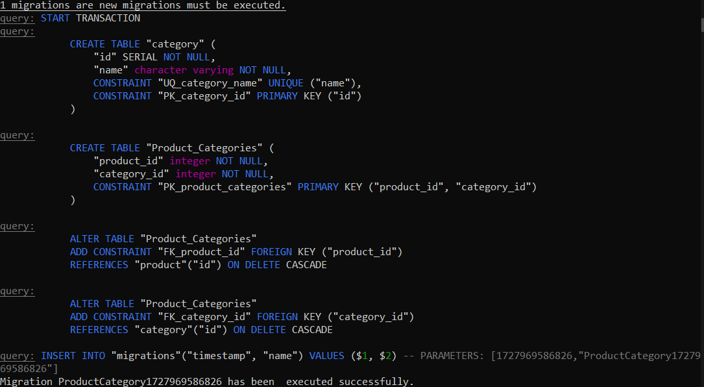

<!-- ABOUT THE PROJECT -->
## About The Project
This project is an ecommerce microservices which contains product, inventory, order managements system and also a payment service with multiple failure to simulate real-production scenario on each call.

Here's a brief explanation:
* product microservice is responsible for creating, updating and delete each product in the system
* inventory is a reservation container to interact with order services while assigning products and take control on remaining products
* order is responsible for assigning products, making sure each order will be processed as success or if failed in case of payment (retries reached more than 5 times) products reservation will be invalidated and released.
* payment microservice is essentially an interface to settle payments related to each order, it also simulates failed transactions, timed out beside processing payments, it also exposes an inquiry method for callers to be notified of the payment transaction status.


### Built With

Technologies/framework used for the project.

* [][nest-url]
* [][kafka-url]
* [][postgres-url]


### Installation
gateway is listening on port 3000

1. Clone the repo
   ```sh
   git clone https://github.com/Denrox/nestjs-microservices-example.git -b main
   ```
2. Use docker compose to build all services images execute below command from the root of the repository.
   ```sh
   docker-compose build
   ```
3. Run this command to start all containers
   ```sh
   docker-compose up -d
   ```
4. Access swagger ui from gateway on port `3000` to test services.
   ```sh
   http://localhost:3000/swagger
   ```
5. Bring down services   
   ```sh
   docker-compose down
   ```
## Migration
First we need to generate a migration file:
```sh
npm run typeorm migration:run -- -d config/dataSourceLocal.ts
```
now we can add SQL operation to introduce new category table and also a join table 
for category-product relations. After adding constraints and introducing foreign keys
and constraints we need to build our code because typeorm is written with pure js 
and will only work with js files:
```shell
npm run build
```
Next, our migration is ready to be executed, we use typeorm CLI directly:
```shell
npx ts-node ./node_modules/typeorm/cli.js migration:run -d config/dataSourceLocal.ts
```

Typeorm will display the migration SQL details and will commit them :

<p align="center">

</p>

For executing migration on docker container, above command added right before migration/product app
begins to start
```shell
CMD npm run build npx ts-node ./node_modules/typeorm/cli.js migration:run -d config/dataSourceLocal.ts && npm run start:dev
```

## Architecture overview
The main purpose of this project is to illustrate an event based ecommerce consisting of multiple microservices that interact via kafka message broker including both request/response and publish/subscribe methods.
If there was a need to process after getting response from another microservice (like payment in order ) immediately, the request/response model was chosen, otherwise publish/subscribe was chosen when there was a need to decoupling services for asynchronous communication.
When a new order is submitted from the client an asynchronous product reservation event is emitted from order service, once inventory be informed of the new request, it tries to deduct reservation quantity from available products by starting new transaction with Pessimistic lock condition, that way we can ensure there is no race conditioning nor dirty writes on concurrent events on multiple inventory services.
After order reservation was done successfully, again, another event is emitted back from inventory to order microservice to resume the payment processing and consequently finalizing the order.
Payment is consist of an inquiry api, in case of network errors or any other failures that there is a need to know the result of the payment, also failure scenario like timeout and not enough fund are simulated for demonstration of retries mechanism which is based on exponential backoff.


<!-- CONTACT -->
## Contact

[comment]: <> ([@email]&#40;https://twitter.com/_username&#41;)
Mohammad Hossein - mmd.hosseinnnn@gmail.com

[comment]: <> (Project Link: [https://github.com/your_username/repo_name]&#40;https://github.com/your_username/repo_name&#41;)
[comment]: <> (<p align="right">&#40;<a href="#readme-top">back to top</a>&#41;</p>)


<p align="right">(<a href="#readme-top">back to top</a>)</p>


<!-- MARKDOWN LINKS & IMAGES -->
<!-- https://www.markdownguide.org/basic-syntax/#reference-style-links -->
[Kafka.apache.org]: https://encrypted-tbn0.gstatic.com/images?q=tbn:ANd9GcRKUqi8UKOYSCtY1cCAtBKaPVnJD1qWN3zBCw&s
[kafka-url]:https://kafka.apache.org/trademark
[nest-url]:https://nestjs.com/
[postgres-url]:https://www.postgresql.org/

